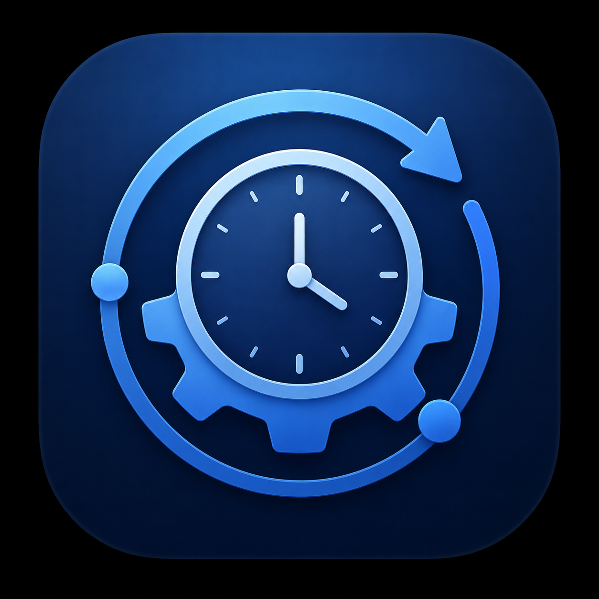
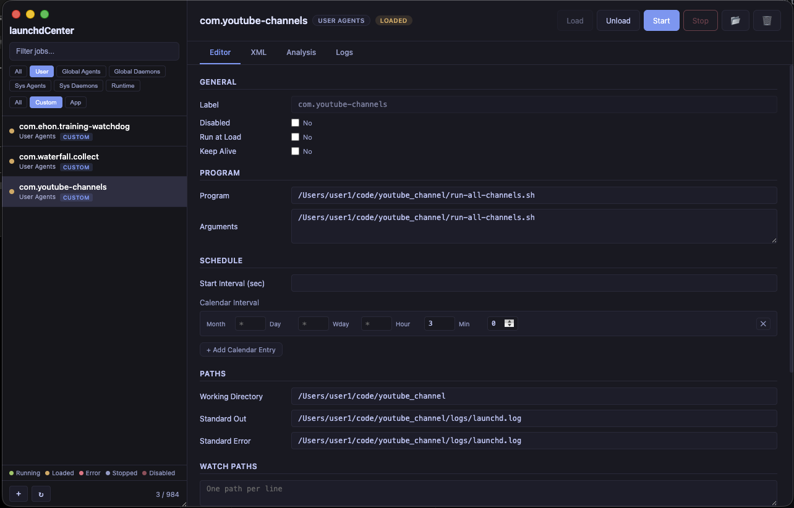

<p align="center">
  
</p>

<h1 align="center">launchdCenter</h1>

<p align="center">
  A GUI application for managing macOS launchd jobs (background services and daemons).
</p>

<p align="center">
  
  
  <a href="https://github.com/qalainau/launchdCenter/releases"></a>
</p>

<p align="center">
  <a href="README.ja.md">日本語</a>
</p>

<p align="center">
  
</p>

## Features

### Job Management
- List jobs across all domains (User Agents, Global Agents/Daemons, System Agents/Daemons)
- Load/unload, start/stop, enable/disable jobs
- Create custom jobs from templates, delete jobs
- Classify job origin (Custom / App / System)

### Status Monitoring
- Real-time status indicators (Running, Loaded, Disabled, Error)
- View PID and last exit status
- Configuration analysis and validation

### Configuration Editing
- Form-based property editing (Program, Arguments, WorkingDirectory, etc.)
- Advanced settings: KeepAlive, StartInterval, StartCalendarInterval, WatchPaths
- Direct XML plist editing with plutil validation

### Log Viewer
- View stdout/stderr log files
- Query macOS unified logs (`log show`)

### UI
- Tabbed interface (Details, Editor, XML, Analysis, Logs)
- Filter by domain and origin
- Real-time search
- Dark mode theme

## Installation

Download the DMG from [Releases](https://github.com/qalainau/launchdCenter/releases).

1. Open the DMG
2. Drag launchdCenter.app to Applications
3. Launch

> Supports Apple Silicon (M1/M2/M3/M4) Macs

## Development

```bash
# Install dependencies
npm install

# Run in development mode
npm run dev

# Build DMG
npm run build:dmg
```

## Tech Stack

- Electron
- Vanilla JavaScript
- plist (npm)

## License

ISC
